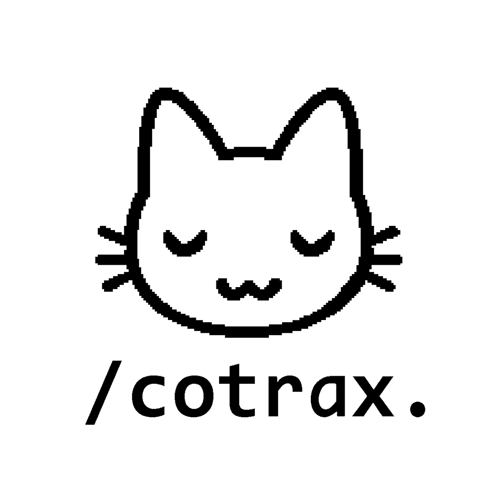

<p align="center">
  
</p>

<p align="center">
  <b>Cotrax</b>
</p>

Cotrax is a Visual Studio Code extension designed to automatically track the time you spend on each project and file, similar to Steam's Playtime feature. This project consists of two main parts:

1. VS Code Extension (Frontend): Runs in your editor, detects activity, and displays a dashboard.
2. Go API (Backend): A powerful backend server for storing, managing, and presenting your time data in a structured manner.

## Features

- **Automatic Tracking:** Time is recorded automatically while you’re active inside VS Code.
- **Visual Dashboard:** View detailed stats of your coding time with a dashboard that shows project lists and a pie chart.
- **Backend System with Databases:**  Save and Log your coding acitivties to the databases

---

## Technologies Used

### Frontend (VS Code Extension)
- TypeScript  
- SQLite3 (for initial/demo local storage)

### Backend (API)
- Go  
- Chi (Router)  
- PostgreSQL (via Supabase)  
- golang-migrate  

### Other Tools
- Postman (for API testing)

---

## Requirements

1. Install [Node.js](https://nodejs.org/en/download), then install the global depedency for extention development
```bash
npm install -g yo generator-code
```

2. Clone the repository
```sh
git clone https://github.com/Myriadn/Cotrax.git
cd Cotrax
```

3. Install all the requirement depedency
```bash
npm install
```

4. Setup [Backend](cotrax_api/README.md) until it runs

5. Run or test the Extension by pressing F5 

---

## Known Issues

You can use this extension with our built-in backend, or run the backend locally on your machine. You can configure the API endpoint in the provided [configuration file](./src/api/apiService.ts), and all available endpoints are already set up. But sometimes there is some issues like:

- Axios timeout error (ECONNABORTED)
When attempting to register a project or file with the Cotrax API, you may encounter the following error message:
```bash
AxiosError: timeout of 10000ms exceeded
code: 'ECONNABORTED'
```
This typically indicates that the request to the remote API endpoint failed to respond in time.

- Failed to register project/file
An error popup may appear:
```bash
Could not register project/file with Cotrax API.
Source: Cotrax
```
This issue is often related to network problems, unreachable API endpoint, or long response delays.

This error does not affect the extension’s functionality. It simply means that new data could not be inserted into the database because it already exists.

---

## Release Notes

We only release on this Hackaton Fest. We dont know if we will continue this project in the future.


### 1.0.0

Initial release of Cotrax

---

**Enjoy!**
